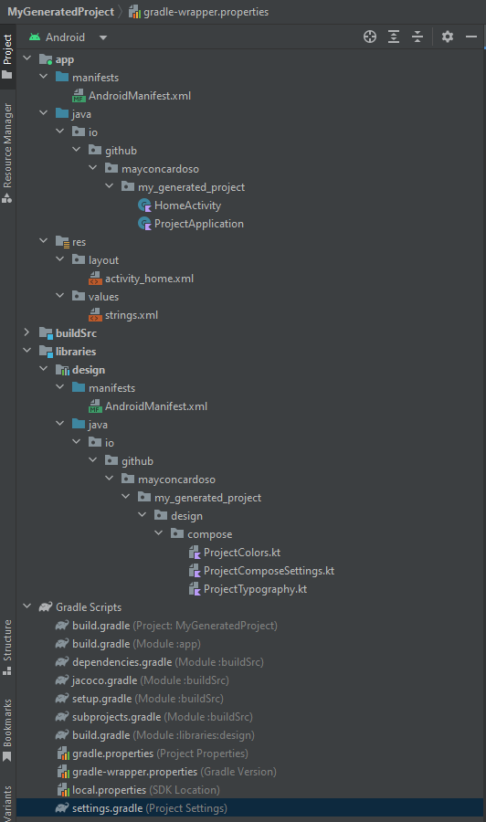
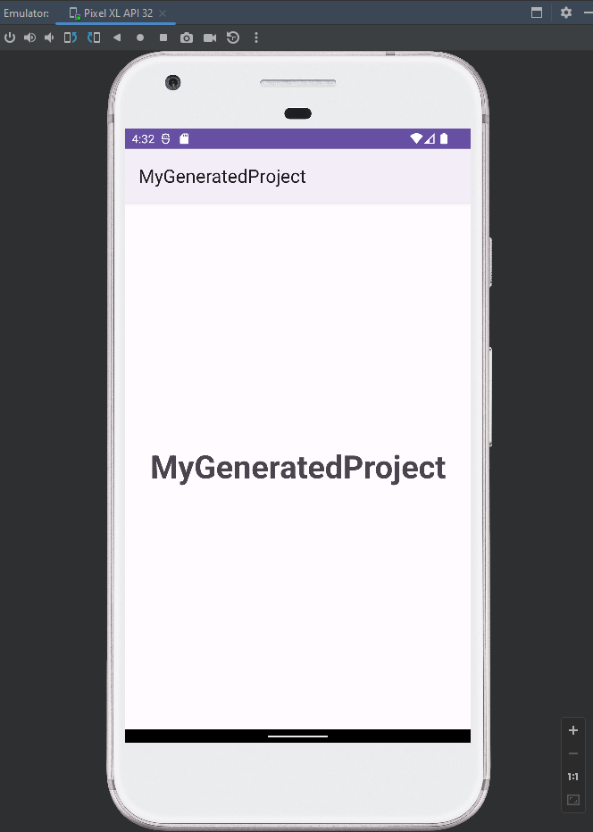

Overview
=

When I joined Unicred Mobile Banking as a Senior Android Engineer back in 2018, the app had a huge monolithic and legacy codebase written in Java. 
One of my first task at Unicred was to define a modularization strategy to refactor the project. The initial strategy was to modularize based on layers to make it easier to decouple components, then the feature layer would be extract in a second refactor.

However, we all know how many boilerplate we need to write to create a new ```feature-module```, don't we? ```ViewModel```, ```Activity or Fragment```, ```UseCases```, ```Many interfaces```, ```Datasources and Repositories``` and so on. 
So, in order to make this refactor journey easier and specially faster, I built this "architecture-code-generator" to create all of the templates we need on the project for each new feature.

After that I decided to make the repo public because it may help someone else out there. The code here doesn't look good yet because the initial intention was to handle the problem we had back there.

## Download Generator

```groovy
implementation 'io.github.mayconcardoso:boilerplate-generator:3.0.0'
```

## Real apps using this

Here are a couple of real android Apps implementing this library to define their architecture.
* [Poker Grinder](https://github.com/MayconCardoso/poker-grinder)
* [StockTradeTracking](https://github.com/MayconCardoso/StockTradeTracking)

Creating a new App
=
You can skip this if you already have an app. 
However, if the goal is create a new app with the basic architectural structure, well this is now much simpler. Just run the code below and see the magic happens.

```kotlin
fun main() {

  // Creates base project settings.
  val projectSettings = ProjectSettings(
    projectName = "MyGeneratedProject",
    projectPackage = Package("io.github.mayconcardoso.my_generated_project"),
    projectAbsolutePath = "C:\\Users\\mayco\\Documents\\Development\\MyGeneratedProject"
  )

  // Defines the duplication strategy
  val duplicatedStrategy = FileDuplicatedStrategy.Replace

  // Creates project generator
  ProjectGenerator.generateEmptyProject(
    settings = projectSettings,
    fileDuplicatedStrategy = duplicatedStrategy,
  )
}
```

Customizations are pretty limited right now, but you can a thing or two for your project if you want to. Just keep in mind the goal of this script is just generate them main structure.

```kotlin
// Creates project generator
ProjectGenerator.generateEmptyProject(
  settings = projectSettings,
  fileDuplicatedStrategy = duplicatedStrategy,
) {

  withGradleClassPath {
    GradleClassPath(
      withJacoco = true,
      withDaggerHilt = true,
      withNavigationSafeArgs = true,
    )
  }

  withCustomAndroidTargets {
    AndroidTargets(
      minSdk = 21,
      targetSdk = 33,
      compileSdk = 33,
      kotlinJvmTarget = 11,
    )
  }

  withPresentationFramework {
    PresentationFramework.Compose
  }
}
```

The code above will generate the entire structure for you as you can see right below here. In the perfect world you just need to open the app on your Android Studio and run it.
 

Creating an empty feature
=

> NOTE: I am making changes on the codebase to make it scalable, so for a while, the documentation may be outdated.

To start your generator you will need a [ProjectSettings](https://github.com/MayconCardoso/ArchitectureBoilerplateGenerator/blob/master/library/src/main/java/com/mctech/architecture/generator/settings/ProjectSettings.kt) instance and a [FeatureSettings](https://github.com/MayconCardoso/ArchitectureBoilerplateGenerator/blob/master/library/src/main/java/com/mctech/architecture/generator/settings/FeatureSettings.kt) instance. Here is an example:

```kotlin
fun main() {
  val projectSettings = ProjectSettings(
    projectPackage = Package("com.mctech.architecture")
  )

  val featureSettings = FeatureSettings(
    createDependencyInjectionModules = false,
    createBothRemoteAndLocalDataSources = true,
    presentationViewModel   = PresentationMode.ActivityAndFragment,
    projectSettings         = projectSettings,
    fileDuplicatedStrategy  = FileDuplicatedStrategy.Replace
  )

  // Here is an empty feature generated
  FeatureGenerator.newFeature(
    settings    = featureSettings,
    featureName = "FeatureEmpty"
  )
}
```

All you are going to do is run this ```main function``` and the files are going to be generated.

## Generated files

### Domain Layer
* [FeatureEmpty.kt](https://github.com/MayconCardoso/ArchitectureBoilerplateGenerator/blob/master/sample/domain/src/main/java/com/mctech/architecture/domain/feature_empty/entity/FeatureEmpty.kt)
* [FeatureEmptyService.kt](https://github.com/MayconCardoso/ArchitectureBoilerplateGenerator/blob/master/sample/domain/src/main/java/com/mctech/architecture/domain/feature_empty/service/FeatureEmptyService.kt)

### Data Layer
* [FeatureEmptyDataSource.kt](https://github.com/MayconCardoso/ArchitectureBoilerplateGenerator/blob/master/sample/data/src/main/java/com/mctech/architecture/data/feature_empty/datasource/FeatureEmptyDataSource.kt)
* [LocalFeatureEmptyDataSource.kt](https://github.com/MayconCardoso/ArchitectureBoilerplateGenerator/blob/master/sample/data/src/main/java/com/mctech/architecture/data/feature_empty/datasource/LocalFeatureEmptyDataSource.kt)
* [RemoteFeatureEmptyDataSource.kt](https://github.com/MayconCardoso/ArchitectureBoilerplateGenerator/blob/master/sample/data/src/main/java/com/mctech/architecture/data/feature_empty/datasource/RemoteFeatureEmptyDataSource.kt) - Check out ```createBothRemoteAndLocalDataSources``` on ```FeatureSettings```
* [FeatureEmptyRepository.kt](https://github.com/MayconCardoso/ArchitectureBoilerplateGenerator/blob/master/sample/data/src/main/java/com/mctech/architecture/data/feature_empty/repository/FeatureEmptyRepository.kt)
* [FeatureEmptyAPI.kt](https://github.com/MayconCardoso/ArchitectureBoilerplateGenerator/blob/master/sample/data/src/main/java/com/mctech/architecture/data/feature_empty/api/FeatureEmptyAPI.kt) - Check out ```createBothRemoteAndLocalDataSources``` on ```FeatureSettings```

### Presentation Layer (New Module)
* [settings.gradle](https://github.com/MayconCardoso/ArchitectureBoilerplateGenerator/blob/master/settings.gradle) - Add new module on the current project file.
* [build.gradle](https://github.com/MayconCardoso/ArchitectureBoilerplateGenerator/blob/master/sample/features/feature-feature-empty/build.gradle)
* [AndroidManifest.xml](https://github.com/MayconCardoso/ArchitectureBoilerplateGenerator/blob/master/sample/features/feature-feature-empty/src/main/AndroidManifest.xml)
* [strings.xml](https://github.com/MayconCardoso/ArchitectureBoilerplateGenerator/blob/master/sample/features/feature-feature-empty/src/main/res/values/strings.xml)
* [activity_feature_empty.xml](https://github.com/MayconCardoso/ArchitectureBoilerplateGenerator/blob/master/sample/features/feature-feature-empty/src/main/res/layout/activity_feature_empty.xml) - Check out ```PresentationMode``` on ```FeatureSettings```
* [fragment_feature_empty.xml](https://github.com/MayconCardoso/ArchitectureBoilerplateGenerator/blob/master/sample/features/feature-feature-empty/src/main/res/layout/fragment_feature_empty.xml) - Check out ```PresentationMode``` on ```FeatureSettings```
* [FeatureEmptyActivity.kt](https://github.com/MayconCardoso/ArchitectureBoilerplateGenerator/blob/master/sample/features/feature-feature-empty/src/main/java/com/mctech/architecture/feature/feature_empty/FeatureEmptyActivity.kt)- Check out ```PresentationMode``` on ```FeatureSettings```
* [FeatureEmptyFragment.kt](https://github.com/MayconCardoso/ArchitectureBoilerplateGenerator/blob/master/sample/features/feature-feature-empty/src/main/java/com/mctech/architecture/feature/feature_empty/FeatureEmptyFragment.kt) - Check out ```PresentationMode``` on ```FeatureSettings```
* [FeatureEmptyViewModel.kt](https://github.com/MayconCardoso/ArchitectureBoilerplateGenerator/blob/master/sample/features/feature-feature-empty/src/main/java/com/mctech/architecture/feature/feature_empty/FeatureEmptyViewModel.kt)

Creating a complete feature with business and presentation logic 
=

To start your generator you will need a [ProjectSettings](https://github.com/MayconCardoso/ArchitectureBoilerplateGenerator/blob/master/library/src/main/java/com/mctech/architecture/generator/settings/ProjectSettings.kt) instance and a [FeatureSettings](https://github.com/MayconCardoso/ArchitectureBoilerplateGenerator/blob/master/library/src/main/java/com/mctech/architecture/generator/settings/FeatureSettings.kt) instance. Here is an example:

```kotlin
fun main() {

  ...
  
  // Here is an empty feature generated
  FeatureGenerator.newFeature(
    settings = featureSettings,
    featureName = "FeatureEmpty"
  ) {
    dataModulePath = ModuleFilePath(
      moduleLocation = "data",
      gradleModuleName = ":sample:data",
      packageValue = Package("$projectPackage.data")
    )

    domainModulePath = ModuleFilePath(
      moduleLocation = "domain",
      gradleModuleName = ":sample:domain",
      packageValue = Package("$projectPackage.domain")
    )

    featureModulePath = ModuleFilePath(
      moduleLocation = "features/feature-${featureSegment()}",
      gradleModuleName = ":sample:features:feature-${featureSegment()}",
      packageValue = Package("$projectPackage.feature.${featurePackage()}")
    )
  }

  // Here is a complex feature with use cases and different liveData.
  FeatureGenerator.newFeature(
    settings = featureSettings,
    featureName = "ComplexFeature"
  ) {
    dataModulePath = ModuleFilePath(
      moduleLocation = "data",
      gradleModuleName = ":sample:data",
      packageValue = Package("$projectPackage.data")
    )

    domainModulePath = ModuleFilePath(
      moduleLocation = "domain",
      gradleModuleName = ":sample:domain",
      packageValue = Package("$projectPackage.domain")
    )

    featureModulePath = ModuleFilePath(
      moduleLocation = "features/feature-${featureSegment()}",
      gradleModuleName = ":sample:features:feature-${featureSegment()}",
      packageValue = Package("$projectPackage.feature.${featurePackage()}")
    )

    // Add fields on entity
    addEntityField(
      Parameter(
        name = "id", type = Type.Long
      )
    )

    addEntityField(
      Parameter(
        name = "name", type = Type.String
      )
    )

    addEntityField(
      Parameter(
        name = "anotherFeature", type = Type.CustomType(
          packageValue = "com.mctech.architecture.domain.feature_empty.entity",
          typeReturn = "FeatureEmpty"
        )
      )
    )


    // Create an use case that will call the repository and delegate it to the data sources and so on.
    addUseCase {
      UseCaseBuilder(
        name = "LoadAllItemsCase",
        returnType = Type.ResultOf(Type.ListOfGeneratedEntity),
        isDaggerInjectable = false
      )
    }

    addUseCase {
      UseCaseBuilder(
        name = "LoadItemDetailCase",
        returnType = Type.ResultOf(Type.GeneratedEntity),
        parameters = listOf(
          Parameter(
            name = "item",
            type = Type.GeneratedEntity
          ),
          Parameter(
            name = "simpleList",
            type = Type.CustomType(
              packageValue = "com.mctech.architecture.domain.feature_empty.entity",
              typeReturn = "FeatureEmpty"
            )
          )
        ),
        isDaggerInjectable = false
      )
    }

    addLiveData {
      LiveDataBuilder(
        name = "items",
        type = Type.ListOfGeneratedEntity
      )
    }

    addLiveData {
      LiveDataBuilder(
        name = "userName",
        type = Type.String
      )
    }

    addComponentState {
      ComponentStateBuilder(
        name = "listEntities",
        type = Type.ListOfGeneratedEntity
      )
    }

    addComponentState {
      ComponentStateBuilder(
        name = "itemDetails",
        type = Type.GeneratedEntity
      )
    }

    addUserInteraction {
      UserInteractionBuilder(
        name = "LoadList",
        connectedState = findStateByName("listEntities"),
        connectedUseCase = findUseCaseByName("LoadAllItemsCase")
      )
    }

    addUserInteraction {
      UserInteractionBuilder(
        name = "OpenDetails",
        parameters = listOf(
          Parameter(
            name = "item",
            type = Type.GeneratedEntity
          ),
          Parameter(
            name = "simpleList",
            type = Type.CustomType(
              packageValue = "com.mctech.architecture.domain.feature_empty.entity",
              typeReturn = "FeatureEmpty"
            )
          )
        ),
        connectedState = findStateByName("itemDetails"),
        connectedUseCase = findUseCaseByName("LoadItemDetailCase")
      )
    }
  }
}
```

## Generated files

### Domain Layer
* [ComplexFeature.kt](https://github.com/MayconCardoso/ArchitectureBoilerplateGenerator/blob/master/sample/domain/src/main/java/com/mctech/architecture/domain/complex_feature/entity/ComplexFeature.kt)
* [ComplexFeatureService.kt](https://github.com/MayconCardoso/ArchitectureBoilerplateGenerator/blob/master/sample/domain/src/main/java/com/mctech/architecture/domain/complex_feature/service/ComplexFeatureService.kt) - With delegation methods of use cases
* [LoadAllItemsCase.kt](https://github.com/MayconCardoso/ArchitectureBoilerplateGenerator/blob/master/sample/domain/src/main/java/com/mctech/architecture/domain/complex_feature/interaction/LoadAllItemsCase.kt)
* [LoadItemDetailCase.kt](https://github.com/MayconCardoso/ArchitectureBoilerplateGenerator/blob/master/sample/domain/src/main/java/com/mctech/architecture/domain/complex_feature/interaction/LoadItemDetailCase.kt)

### Data Layer
* [ComplexFeatureDataSource.kt](https://github.com/MayconCardoso/ArchitectureBoilerplateGenerator/blob/master/sample/data/src/main/java/com/mctech/architecture/data/complex_feature/datasource/ComplexFeatureDataSource.kt) - With delegation methods of use cases
* [LocalComplexFeatureDataSource.kt](https://github.com/MayconCardoso/ArchitectureBoilerplateGenerator/blob/master/sample/data/src/main/java/com/mctech/architecture/data/complex_feature/datasource/LocalComplexFeatureDataSource.kt) - With delegation methods of use cases
* [RemoteComplexFeatureDataSource.kt](https://github.com/MayconCardoso/ArchitectureBoilerplateGenerator/blob/master/sample/data/src/main/java/com/mctech/architecture/data/complex_feature/datasource/RemoteComplexFeatureDataSource.kt) - With delegation methods of use cases
* [ComplexFeatureRepository.kt](https://github.com/MayconCardoso/ArchitectureBoilerplateGenerator/blob/master/sample/data/src/main/java/com/mctech/architecture/data/complex_feature/repository/ComplexFeatureRepository.kt) - With delegation methods of use cases
* [ComplexFeatureAPI.kt](https://github.com/MayconCardoso/ArchitectureBoilerplateGenerator/blob/master/sample/data/src/main/java/com/mctech/architecture/data/complex_feature/api/ComplexFeatureAPI.kt) - With delegation methods of use cases

### Presentation Layer (New Module)
* [settings.gradle](https://github.com/MayconCardoso/ArchitectureBoilerplateGenerator/blob/master/settings.gradle) - Add new module on the current project file.
* [build.gradle](https://github.com/MayconCardoso/ArchitectureBoilerplateGenerator/blob/master/sample/features/feature-complex-feature/build.gradle)
* [AndroidManifest.xml](https://github.com/MayconCardoso/ArchitectureBoilerplateGenerator/blob/master/sample/features/feature-complex-feature/src/main/AndroidManifest.xml)
* [strings.xml](https://github.com/MayconCardoso/ArchitectureBoilerplateGenerator/blob/master/sample/features/feature-complex-feature/src/main/res/values/strings.xml)
* [activity_complex_feature.xml](https://github.com/MayconCardoso/ArchitectureBoilerplateGenerator/blob/master/sample/features/feature-complex-feature/src/main/res/layout/activity_complex_feature.xml)
* [fragment_complex_feature.xml](https://github.com/MayconCardoso/ArchitectureBoilerplateGenerator/blob/master/sample/features/feature-complex-feature/src/main/res/layout/fragment_complex_feature.xml)
* [ComplexFeatureActivity.kt](https://github.com/MayconCardoso/ArchitectureBoilerplateGenerator/blob/master/sample/features/feature-complex-feature/src/main/java/com/mctech/architecture/feature/complex_feature/ComplexFeatureActivity.kt) - With delegation methods of LiveData
* [ComplexFeatureFragment.kt](https://github.com/MayconCardoso/ArchitectureBoilerplateGenerator/blob/master/sample/features/feature-complex-feature/src/main/java/com/mctech/architecture/feature/complex_feature/ComplexFeatureFragment.kt)  - With delegation methods of LiveData
* [ComplexFeatureViewModel.kt](https://github.com/MayconCardoso/ArchitectureBoilerplateGenerator/blob/master/sample/features/feature-complex-feature/src/main/java/com/mctech/architecture/feature/complex_feature/ComplexFeatureViewModel.kt) - With delegation methods of LiveData
* [ComplexFeatureUserInteraction.kt](https://github.com/MayconCardoso/ArchitectureBoilerplateGenerator/blob/master/sample/features/feature-complex-feature/src/main/java/com/mctech/architecture/feature/complex_feature/ComplexFeatureUserInteraction.kt) 

Roadmap
=

* Improve code (Yeah, I know the code is not good, but again, this library was a personal generator before it became open source) :P
* Make the generator easier to be used
* Improve the templates logic.
* Create an extension library and organize all existing functions.
* Create all unit tests.
